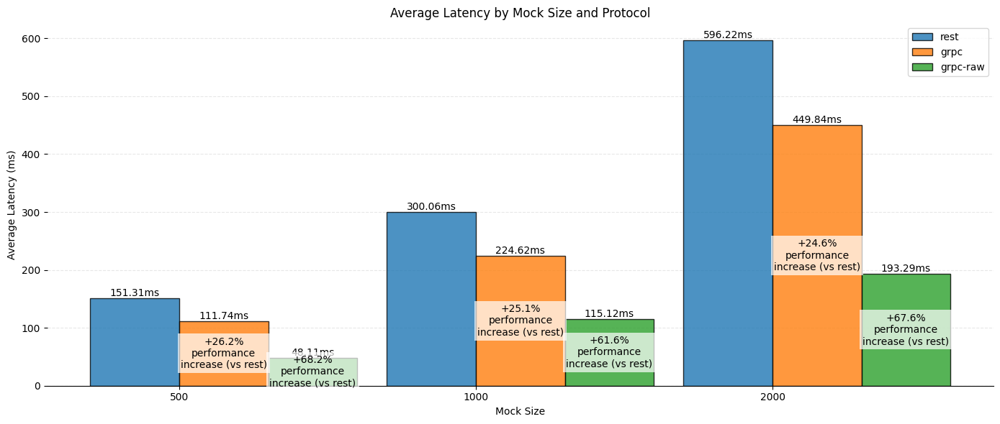
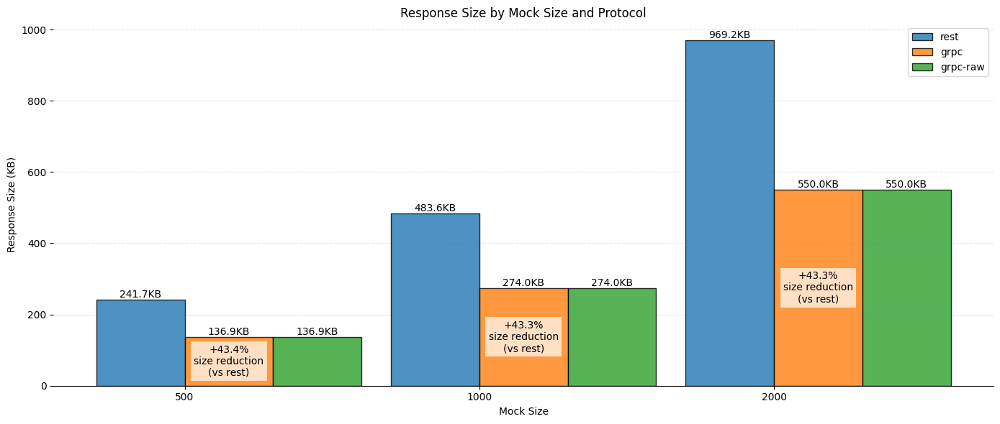

# gRPC vs REST with JSON Performance Benchmark

This repository contains a performance benchmark comparison between gRPC and REST API implementations.

## Description

This project provides a comprehensive benchmark suite to compare performance between gRPC and REST with JSON APIs. It includes test fixtures and utilities to measure latency between client and server communications using both protocols.

The benchmark focuses on:
- Client-to-server request latency
- Different payload sizes using a sample population dataset
- Real-world usage scenarios with structured data
- Direct comparison between REST (JSON/HTTP) and gRPC (Protocol Buffers/HTTP2)

## Results

### Latency

The benchmark results show that gRPC consistently outperforms REST across all payload sizes, with approximately 25% lower latency compared to REST. When using raw gRPC (without additional processing), the performance advantage increases to over 60% improvement in latency.

### Response Size

The benchmark demonstrates that gRPC with Protocol Buffers achieves approximately 43% smaller response sizes compared to REST with JSON across all payload sizes. This reduction in message size contributes to improved network efficiency and reduced bandwidth consumption.

## Project Structure

- `proto/`: Contains Protocol Buffer definitions
- `testutil/fixtures/`: Test data and fixture generation utilities
  - `generate_fixtures.py`: Script to generate test data in both JSON and Protocol Buffer formats
  - `fixtures_population_100.json`: Sample population data in JSON format
  - `fixtures_population_100.pb`: Sample population data in Protocol Buffer format

## General Testing

Tests can be run to compare the performance characteristics of both API implementations.

